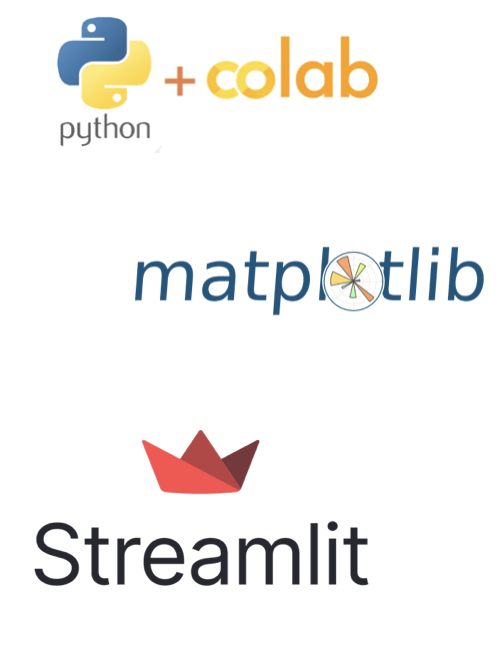
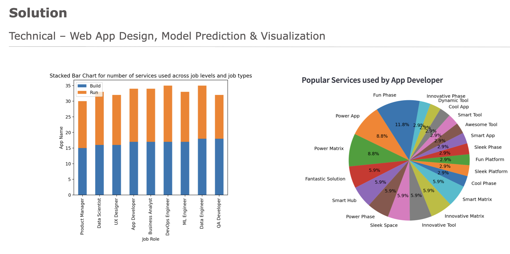
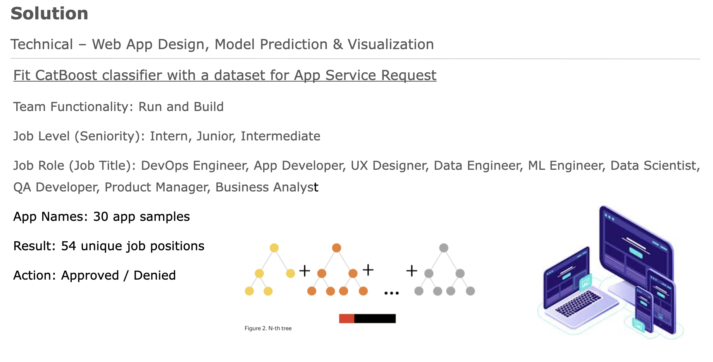
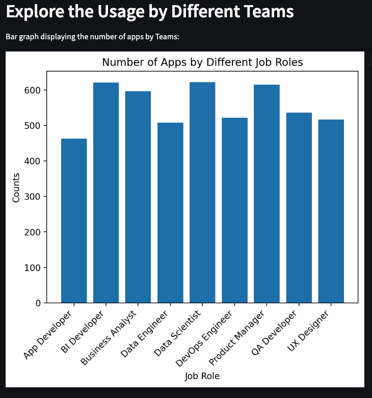
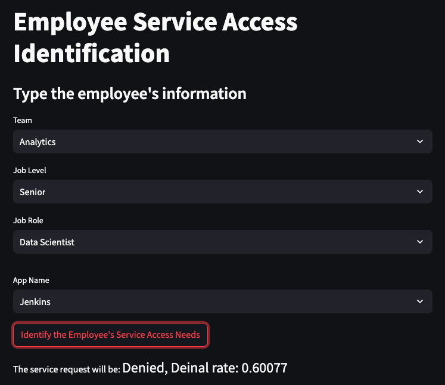

Project Summary

Web App Link: https://service-access-automation.streamlit.app/

The Problem:

Employee need access to various services during their time at UPS.
LapTop Admin Rights, Azure DevOps, Database, etc.

Access to these services are currently handled on case-by -case basis.

Business Solution:
Employee services automation tool quickens the granting process for the app service accesses to new hires and interns who onboard the compmany. 

Employee takes a job profile survey, which recommends services they may need access to based on their position, level, and historical data.
Managers / leads can approve the services more quickly based on the recommendations, enabling new employees to access the tools faster and begin to work sooner.

Technical solution:
Tools used -> Streamlit App Design, Catboost Model Prediction and Data Visualization.

Metrics:

The positive label indicates the service access app given in an employee record was approved and granted for access use, vice versas. The most crucial metric here will be the recall rate since the cost of not granting app service access to the right group of people in time is greater than granting an extra app service access to a random employee. Thereforem, the Catboost model needs to grow true positives and reduce the occurrences of false negatives.

