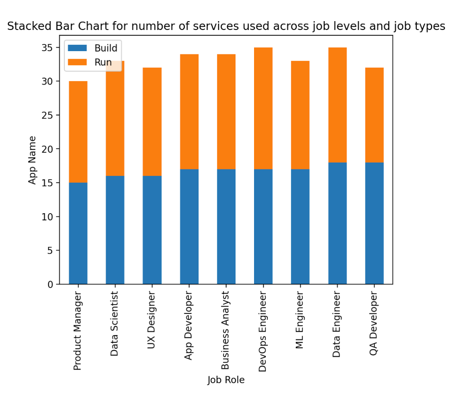
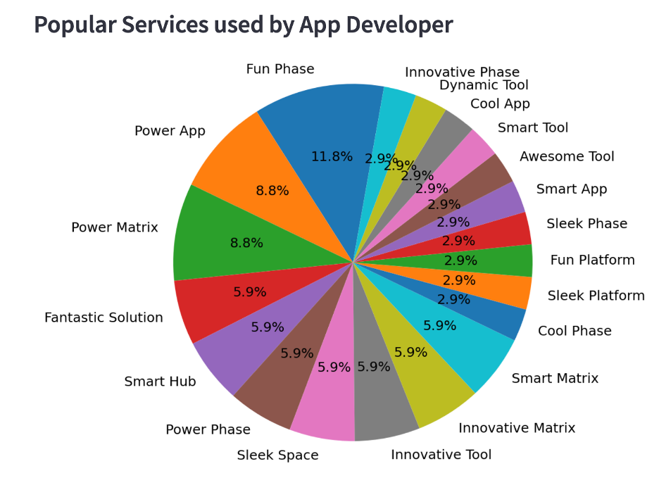

# Employee Access Recommender System

## Introduction

In many organizations, the process of granting employees access to necessary resources is often reactive and manual, leading to inefficiencies and wasted time. The Employee Access Recommender System is designed to automate this process using predictive modeling. By analyzing historical data on employees' roles and their access patterns, the system intelligently predicts access needs, facilitating a proactive approach to resource permissioning.

## Objective

The objective of this project is to create a predictive model that minimizes manual access transactions, such as grants and revokes, by accurately determining employees' access needs as their roles evolve within the company. 

## Solution

We've developed a user-friendly Streamlit web application, leveraging the power of a CatBoost model, to predict and visualize employee access needs with high accuracy. The application streamlines the process for supervisors, allowing for efficient access management and a smoother workflow for employees.

---

##Installation
Download the entire github package, load it onto a platform like VSCodes, change to the current folder directory.

##Usage
The easiet way to run app.py is to run the following command:
```console
streamlit run app.py
```

## Web Application Interface

Below are the screenshots of the web application interface showcasing the assessment and exploration features with visualizations.

### Assessment Page


This is the assessment page where users can input employee details to predict access needs.

### Exploration with Visualizations


This page provides a visualization interface for exploring the patterns and insights derived from the model predictions.


